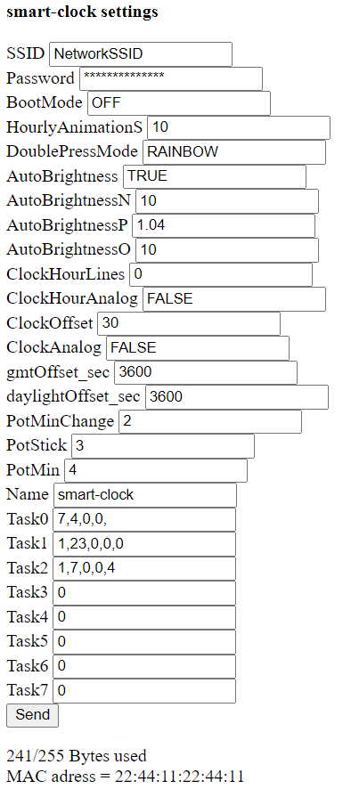

# Smart clock
A smart 3D printed light clock/lamp, that includes, but is not limited to; WIFI and manual control, Clock mode, multiple animations, and transitions.

If you have interest in buying one and live in The Netherlands, feel free to contact me.

# Creating a unit
You can skip to [Quick start guide](#quick-start-guide) if you already own a smart-clock, and just want to run the set-up.

## Hardware
- a [PCB lamp](https://easyeda.com/jellewietsma/smart-light) or [PCB wall](https://easyeda.com/jellewietsma/smart-clock)
- All parts listed in the BOM of the PCB, these include resistors, capacitors, buttons, potmeters, and an ESP32
- Others things like Potmeter caps, DC jack cable and adapter, but also some magnets if you want the magnetic option for the desk version (these are by default 4x10mm round magnets)

## Firmware 
The firmware needs to be flashed once to enable [OTA](#ota-over-the-air-update) bin file upload. Either with Arduino IDE and compile it, or using a bin uploader of choice.
Note that [SoftSettings](#soft-settings) (user settings) are reserved as long as the FLASH is not wiped.

### To compile
- [Arduino sketch](Arduino) The whole sketch is the 'Arduino' folder.
- [ESP32](https://dl.espressif.com/dl/package_esp32_index.json) must be added as an aditional board manager in Arduino IDE.
- [FastLED](https://github.com/FastLED/FastLED) can be downloaded though the buildin libaray anager in Arduino IDE.

- [Arduino-WIFIManager](https://github.com/jellewie/Arduino-WiFiManager) (already included).
- [Arduino-Button](https://github.com/jellewie/Arduino-Button) (already included).
- [Arduino-Stable-analog-read](https://github.com/jellewie/Arduino-Stable-analog-read) (already included).

### To upload
Uploading a BIN file with a cable to the ESP can be done by any [ESP32 BIN file uploader](https://www.espressif.com/en/support/download/other-tools). this step is required for the first flash time.

The BIN files themself can be found at [releases](https://github.com/jellewie/Arduino-Smart-light/releases). The newest version is always recommended and can be updated with [OTA](#ota-over-the-air-update).

## Printing
### Desk model
There are 4 files that need to be printed
1.	[Lamp body.stl](3DModel/Desk/Body.stl) is the main body. It is suggested to do at least 0.5mm walls so light will not shine though as much.
2.	[Lamp shield.stl](3DModel/Desk/Shield.stl) is just a simple shield to add aluminium foil on, and will be intern so can be printed quick and dirty.
3.	[Lamp stand.stl](3DModel/Desk/Stand.stl) can have 3 times a pair embedded magnets in it, if the magnets are desired a layer pause need to be used.
4.	[Diffuser.gcode](3DModel/Desk/Diffuser.gcode) A perfect spiral Gcode, this can be created with [Jespers Perfect Spiral-Gcode](https://github.com/jespertheend/spiral-gcode).

### Wall model
There are 2 files that need to be printed
1.	[Clock Top.stl](3DModel/Wall/Clock%20Top.stl) This is the top of the clock, which houses the PCB controls.
2.	[Clock x2.stl](3DModel/Wall/Clock%20x2.stl) This needs to be printed twice, and is the bottom left and right.

## PCB & wires
Please refer the in the [appendix](#appendix) - PCB & schematic for the schematic, but here are some common notes about the schematic, for example in [Input voltage](#Specifications) and [power consumption](#power-consumption) more information is given about the specifications of the electrics.

# Quick start guide 
Follow the following steps to setup the lamp, stop after the first step if you do not want to set up Wi-Fi.
1.	Connect a proper power supply. The LEDs will blink shortly a soft white for a split second to show that bootup was successful.
2.	The [potmeters](#pot-meter) or [button](#button) change the light
**Optional for WIFI:**
3.	Long press the button, this will make the LEDs go PURPLE/RED/PURPLE/RED this means it is trying to connect to Wi-Fi, if this takes more than 10 seconds it will have created an Access Point. (Long press the button again to cancel this setup)
4.	Connect to this Access Point, by default it will be called “smart-clock”.
5.	When connected go to [192.168.4.1](http://192.168.4.1/) this will show a page where the WIFI name (SSID) and password (Password) can be set, do not forget to submit to apply. Other settings on this page are explained in [soft settings](#soft-settings).
~~The light will also try to make a captive portal to prompt you to login and setup these settings. Sadly, this only works with HTTP, use the mentioned IP if the device does not prompt the login page ([Not working as of now, Known issue](https://github.com/jellewie/Arduino-Smart-light/issues/28))~~ 
6.	When the device is connected to WIFI it can be accessed by its IP address, but on devices who support mDNS, like Windows and Apple, [smart-clock.local/info](http://smart-clock.local/info) can be used.

# Features
## Button
Although these options change a bit over time, here is a list of 3 actions what the button generally does, these can also change in different modes.
1.	**StartPress** Triggered when you start a press, will be rejected if sooner than Time_RejectStarts (80ms) of the last press).
- Will toggle the lamp ON/OFF
2.	**StartDoublePress** Triggered when you start a second press between Time_RejectStarts (80ms) and Time_StartDoublePress (200ms) after the last one ended.
- Will change the mode to 'DoublePressMode' (RAINBOW by default)
3.	**StartLongPress** Triggered when you press the button longer than Time_StartLongPressMS (5000) but shorter than Time_ESPrestartMS (15000) ms.
- If in APmode it will cancel and reboot.
- If it was connected to WIFI it will show its IP, Which is explained in [WIFI page](#wifi-page) - Getting it’s IP.
- If it isn’t connected to WIFI it will start connecting to WIFI (and possibly go into AP mode, that is explained in 

## LED status
In the back of the desk lamp is a LED. This is also the LED into PCB of the ESP (LED_BUILDIN) this LED reflects some more errors.
- **ON** WIFI starts, goes OFF when WIFI setup is successfully completed.
- **blink 100ms** WIFI setup failed, APmode has started.
- **blink 500ms** it is connecting to its known WIFI.
- **blink 1000ms** OTA is on.
- **blink 2000ms** WIFI is lost, so the current time (we are in CLOCK mode) cannot be updated.

Some statuses are also reflected by the LED strip itself, but due to the difficulty driving these in some WIFI modes, these are not used much.
- **White short blink** It is booting up.
- **PURPLE/BLUE/PURPLE/BLUE** It is starting the WIFI connect code.
- **PURPLE/RED/PURPLE/RED** It is starting the Access Point code (WIFI could not connect).
- **PURPLE/GREEN/PURPLE/GREEN** It is starting the get server time code.

## Pot meter
The 4 pot meters are Red, Green, Blue, and White. Where white stand for the luminescence. When any of these are turned the mode will switch to on/manual and the RGB value will be shown.

## WIFI page
Here are the 2 most important pages listed with their descriptions. Keep in mind more functions could be added or a different layout could be used, but the intention should be the same as these.
Some special functions might not be listed here. If important things missing feel free to contact me!

### Setup

The setup page will be accessible and shown in APmode, but can also be access by going to [smart-clock.local/ip](http://smart-clock.local/ip). An example of this page is shown in the figure on the right.
The password is replaced with starts, and cannot be received without changing the firmware. 
Leave fields blank (or for the password leaving only stars) to not update those values upon sending this forum.
By default the SSID and password is limited to 16 characters by the firmware, and the total bytes that can be stored in memory is limited to 128. Going over these values results in unexpected behaviour. 

### Getting it’s IP
User devices that support mDNS, like Windows and Apple, can use [smart-clock.local/info](http://smart-clock.local/info) to obtain its IP.

Alternatively the IP can be shown in the LEDs themself. To trigger this see [Button](#Button).
The LEDs are divided into 10 sections, and each byte in the IP range will be shown one at a time, to goto the next section press the button shortly again. The numbers are like a clock and in clockwise direction, top/right is 0 and the one right/down of that is 1. Where RGB will be the order of the numbers, so red will have a x100 multiplication and green will have x10, so when the IP is 198.168.1.150 and it shows the last section (150) then section 1 will be Red, 5 will be green and 0 will be blue. This is shown in the figure below

### Control

The control page is the default landing page the user will land on. An example of this page is shown in the figure on the right.

- **The brightness slider** will always change the brightness no matter in what mode it is in (except for AP since that is not a defined mode), these values are only send and updated on releasing the slide bar. This will also turn off auto brightness.
- **The RGB sliders** will either (try) change the animation accent to the given RGB colour, or switch the mode to Wi-Fi control and set the RGB colour.
- **Settings button** The gear on the right lower corner will open the settings page.

An example of the settings page is shown in the figure on the right.

- **Mode** is the current mode the light is in.
- **Bootmode** is the mode the light will go into on start-up. Altough not all modes are visible on the webpage it supports all modes. To do this a custom webrequest needs to be made (in this case and in the time of writing [smart-clock.local/set?m=MOVE](smart-clock.local/set?m=MOVE)).
- **Doublepress mode** is the mode the light will switch to when a double press on the button is made.
- **Auto brightness** will set the brightness automatically.
- **Hourly animation** is when the light is in the clock mode an hourly animation needs to be played.
- **Hourly lines** when in clock mode, will add lines to each hour, the value is the amount on a byte scale (0-255) dimmed by the brightness itself..
- **Analog hours** will let the hour indicator take 60 instead of 12 steps, so it will not stick to the whole hours indication.
- **Enable OTA** will enable [Over The Air updates](#ota-over-the-air-update), so the firmware can be updated over the WiFi.
- **Sync time** will get the current updated time from the server, this function is called automatically every day on 04:00 if the light is in clock mode.
- **Reset** will fully restart the ESP.
- **Info** will open the info page with some information like the version compile date.
- **Task** this will show a task menu, so tasks can be scheduled or removed.
- **Saved settings** just redirects you to [smart-clock.local/ip](http://smart-clock.local/ip) to show you the values saved in the EEPROM.

### Soft settings
There are multiple soft settings, these are settings that can be changed after the sketch has been uploaded, but are still saved so they can be restored after a reboot.
The most up-to-date values can be found in the top of the [WifiManager.h](Arduino/WifiManager.h) source file, and can only be set in [smart-clock.local/ip](http://smart-clock.local/ip).
These settings are saved EEPROMSaveDelayMS (Default 30000ms) after the last change of SoftSettings, or directly after APmode and in the [smart-clock.local/ip](http://smart-clock.local/ip) page.
Note that the character " and TAB (EEPROM_Seperator) can not be used, these will be replace with ' and SPACE respectively
- **Bootmode** In which mode to start in after start-up
- **HourlyAnimationS** If it needs to show hourly animations when in CLOCK mode, defined in time in seconds where 0=off.
- **DoublePressMode** In what mode to go into when the button is double pressed.
- **AutoBrightness** Turns on brightness if enabled, the curve of which can be set with N and P.
- **AutoBrightnessN** Used to calculate auto brightness =P*(X-N)+O. please see https://www.desmos.com/calculator/5tpxxofamn
- **AutoBrightnessP** ^ Just the lowest raw sensor value you can find
- **AutoBrightnessO** ^ Just an brigtness offset, so it can be set to be globaly more bright
- **ClockHourLines** how bright each hour mark needs to be on a scale of 0 (OFF) to 255.
- **ClockHourAnalog** Will use all 60 LEDs to display the hour, not just stick to wholes and use 12.
- **ClockOffset** Number of LEDs to offset/rotate the clock, so 12 o'clock would be UP. Does NOT work in Animations.
- **ClockAnalog** Makes it so the LEDs dont step, but smootly transition. This does cost considerable more processing power. Makes ClockHourAnalog useless. https://www.desmos.com/calculator/zkl6idhjvx
- **gmtOffset_sec** Offset of time in seconds of GMT, for example Amsterdam is GMT+1h so thats 3600 seconds.
- **daylightOffset_sec** Offset of time in seconds daylight saving time, for example Amsterdam has a 1 hour saving time so thats 3600 seconds.
- **PotMinChange** How much the pot_value needs to change before we process it.
- **PotStick** If this close to HIGH or LOW stick to it.
- **PotMin** On how much pot_value_change need to change, to set mode to manual.
- **Name** The mDNS, WIFI APmode SSID, and OTA name of the device. This requires a restart to apply, can only be 16 characters long, and special characters are not recommended.
- **Task#** 8 tasks (0-7), the format is described in [task-list](#task-list)

### Clock mode
For the use of clock mode the right time zone needs to be set up, these are stored in gmtOffset_sec and daylightOffset_sec (Default to Amsterdam time). 

Clock mode can only be started when WIFI has been connected and the user switches mode, after switching to Clockmode the lamp will turn PURPLE/GREEN/PURPLE/GREEN this means it is getting the time from a time server.

Also the clock can be manual updated with [smart-clock.local/time?h=3&m=59&s=50](http://smart-clock.local/time?h=3&m=59&s=50) where H is hours, M is minutes, and S is seconds. The clock also automatically updates every day at 4:00

Furthermore the clock has some softsettings like ClockHourLines, but these are descibed in [Soft settings](#soft-settings)

### Task List

This page can be accesed on by opening the settings menu and clicking on the button 'Tasks'
There can be 16 tasks, and the first 8 will be saved to EEPROM and will be restored after boot. 
By default the SYNCTIME had been added at 4:0:0

The format of Tasks "TimeH,TimeM,TimeS,TaskType,Var"
- I, the number in the list (0-15) assigned automatically 
- Time, 3x in the format of HH:MM:SS "x,y,z" |OR| time in ms to execute "w" (w are not saved in EEPROM)
- TaskType, the type of task and automatically convered to show the name. (see TaskString in Task.h)
- Var, this can be a custom variable (few examples are given below)

Some examples of TaskType and Var:
	TaskType (x but converted to name) - Var (x but can be converted to name)
1. SWITCHMODE - New mode to switch to "x" either in string or ID form 
2. DIMMING - Stepsize,GoTo,TimeInterfall in ms "x,y,z"
3. BRIGHTEN - Stepsize,GoTo,TimeInterfall in ms "x,y,z"
4. RESETESP
5. CHANGERGB - Red,Green,Blue,OPT_Brightness "x,y,z" |OR| "x,y,z,w"
6. SAVEEEPROM
7. SYNCTIME
8. AUTOBRIGHTNESS - True/false "x" either in string or ID form 
9. HOURLYANIMATIONS - Time in seconds for the animation "x" 

### OTA (Over The Air update)
This page can be accesed on [smart-clock.local/ota](http://smart-clock.local/ota)
On this page is a 'choose file' button where the new version can be selected. Make sure the right, compatible, most updated file is selected ("Smart_clock.bin"). This can be downloaded from [github.com/jellewie/Arduino-Smart-light/releases](https://github.com/jellewie/Arduino-Smart-light/releases). 
After which the 'Upload' button needs to be press for the update process to begin, The unit will automatically update and reboot afterwards.

### Full reset
If a full reset is desired it can be achieved by going to http://smart-clock.local/reset. But note that accesing the page will directly wipe all userdata from existance and there will be no way to restore this (all [#soft-settings](#soft-settings) store in the EEPROM). If the wipe was succesfull it will be reported back and will execute a restart.

# Specifications 
## Input voltage
The power supply is either 5V or 12V. The difference in the voltage is the used LED strip. If the WS2812B is used it would need to be 5V, but if the WS2815 (with redundant data lines) is used then 12V is required.

The pinout of the DC jack has by default positive polarity. Meaning the outer tube -as shown in the figure right- is the ground connection. The lamp will fail to work otherwise (but is able to handle the shock).
## Power consumption
The lamp will consume 18Watts at maximum, so as an example for 12V a 1.5A (or 5V at 3.6A) power supply is required to allow full brightness. Although actual measurements came closer to 12Watt.

The idle power consumption is about 0.65Watt (measured with LEDs turned off, and WIFI turned on)

# Appendix
* Firmware
[This is included in this repository](Arduino)
* PCB & schematic
[Smart light](https://easyeda.com/jellewietsma/smart-light)
[Smart clock](https://easyeda.com/jellewietsma/smart-clock)
* 3D models
[These are included in this repository](3DModel)
